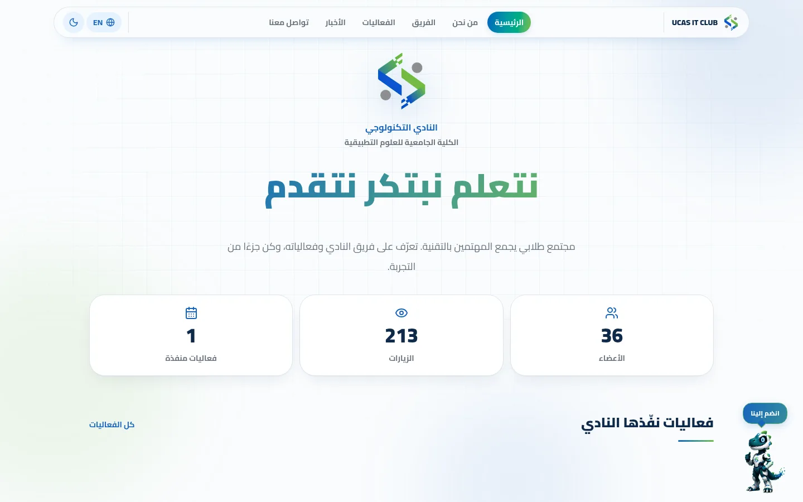
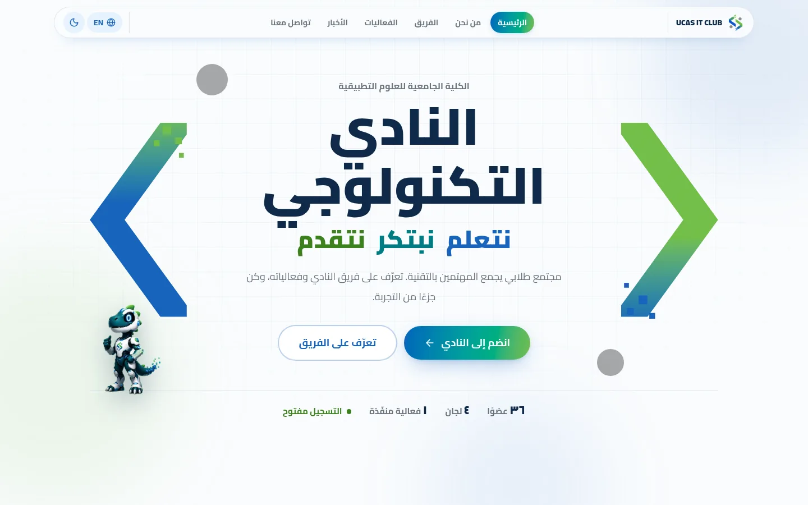
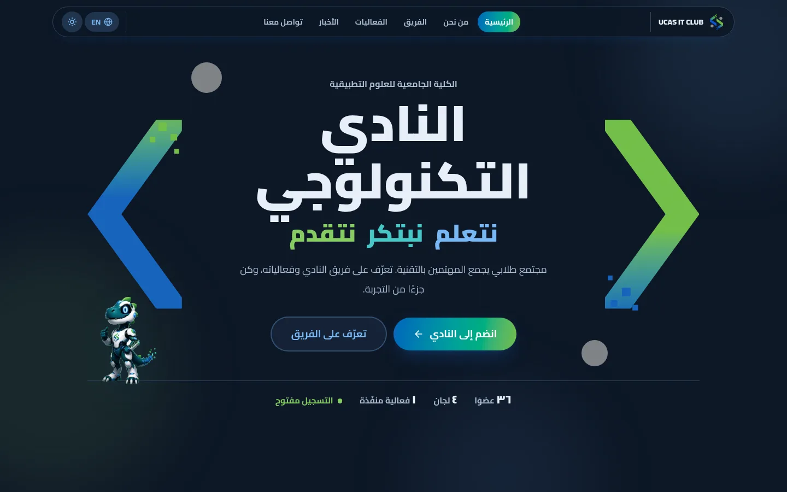
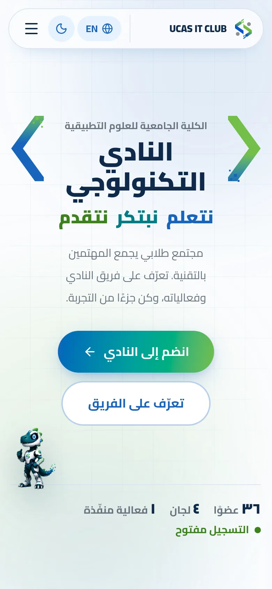
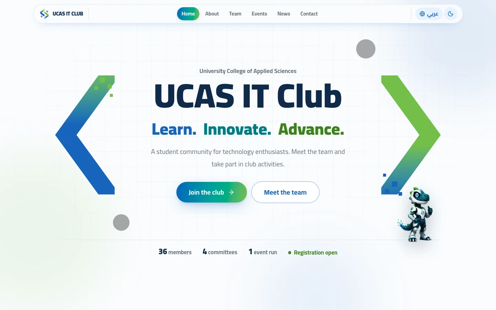

# Home hero: Bracket Stage

**Status (24 Sep 2026): chosen direction, not built.** The live site is unchanged. Nothing below ships until the redesign is agreed.

One of three home-hero concepts prototyped on 24 Sep 2026 (the others were "Source File", a live code editor, and "Pixel Roster", one square per member). This one was picked.

| Before                                                           | Bracket Stage                                                             |
| ---------------------------------------------------------------- | ------------------------------------------------------------------------- |
|  |  |

| Dark                                             | Phone                                             | English                                              |
| ------------------------------------------------ | ------------------------------------------------- | ---------------------------------------------------- |
|  |  |  |

## The idea

The logo is two chevrons, `<` and `>`. The hero draws them at page scale and puts the club's name between them, like content inside a tag. The brand becomes the layout instead of a small image above a headline.

## What does not change

Logo, blue `#1864BC` / green `#73BF49` / grey `#959799`, navy, Cairo, the mascot, the motto «نتعلم نبتكر نتقدم», the header, and every section below the hero (events, news). Only the hero and the stats row under it are replaced.

## Layout

Top to bottom, inside one full-width stage:

1. **Stage row**, three columns: left chevron, copy, right chevron. The chevrons are about 11rem wide on desktop and 12vw on phones.
2. **Copy**, centred: college name (small) → club name as the `h1` (up to 5.75rem, weight 900) → motto with one colour per word (blue, teal, green: the logo's gradient as three solid inks, no gradient text) → the existing one-line description → buttons.
3. **Buttons**: while registration is open, **انضم إلى النادي** (primary, links to `/join`) and **تعرّف على الفريق** (outline, links to `/team`). While it is closed, the primary becomes **تابعنا على إنستغرام** (the Instagram link from settings), so the hero never dead-ends.
4. **Ground line**: one hairline across the stage with the mascot standing on it, leaning under the chevron on the inline-end side. Under the line, one row of facts as a sentence, not stat cards: `٣٦ عضوًا · ٤ لجان · ١ فعالية منفّذة · ● التسجيل مفتوح`.
5. **Grey dots**: the logo's two grey circles, on the diagonal opposite the mascot so they never overlap it.

The stage is always laid out left-to-right, because the mark reads `< >` in both languages. The copy inside it follows the page language.

**Phones:** the chevrons shrink and sit beside the club name, the dots are hidden, the buttons stack, and the facts wrap next to a smaller mascot.

## Content rules

- Every number comes from live data (member count, committees that have members, events, `registrationOpen`). Nothing is typed in by hand.
- The visit counter and the three stat cards leave the hero.
- The floating "انضم إلينا" mascot is hidden on the home page, because the hero already carries the mascot and the Join button. It stays on every other page.
- Existing copy only. No new claims or taglines.
- The biggest functional change: the current hero has no Join button at all; this one leads with it.

## Motion

One entrance moment only. The chevrons slide apart from the centre (1.15 s, ease-out), then the pixel squares, grey dots and mascot pop in. The green dot before "registration open" pulses. Everything is visible without JavaScript, and `prefers-reduced-motion` turns all of it off.

## Accessibility

- The club name is the page's `h1`. The chevrons, dots and mascot are `aria-hidden`.
- The raw logo green fails contrast as text on white, so the motto uses darker brand inks in light mode (`--hc-ink-*`) and the lighter theme tokens in dark mode.
- Checked in both themes, Arabic and English, at 1440 × 900 and 390 × 844. No horizontal scroll.

## Known limits

- It says _who_ the club is more than _what it does_. The facts line and the sections below carry the rest.
- On phones the chevrons are accents, not architecture.
- `club-mascot.webp` is 256 × 401, so it looks slightly soft on high-density screens at the size used here. A 2× export would fix that.

## How to build it (when agreed)

1. Add the two files below as `src/components/club/HeroBracket.tsx` and `src/components/club/hero-bracket.css`.
2. In `Home()` in `src/components/club/ClubSite.tsx`, replace the `<HeroSection>…</HeroSection>` block and the three-card stats grid under it with `<BracketHero />`.
3. In `Shell()` in the same file, skip `<FloatingJoin>` when `page === ""`.
4. Check it in both themes, both languages, and at phone width.

## Reference code

Type-checks against the repo as of commit `92ef5ed`.

### `src/components/club/HeroBracket.tsx`

```tsx
import { Link } from "@tanstack/react-router";
import { ArrowLeft, ArrowRight, Instagram } from "lucide-react";
import { useClub } from "./ClubProvider";
import { brandButtonClass } from "./BrandButton";
import { hrefOf } from "@/lib/club/paths";
import { safeUrl } from "@/lib/club/model";
import mascot from "@/assets/club-mascot.webp";
import "./hero-bracket.css";

const committeeNames: Record<string, [string, string]> = {
  administrative: ["الهيئة الإدارية", "Board"],
  activities: ["الأنشطة", "Activities"],
  relations: ["العلاقات العامة", "Public relations"],
  media: ["الإعلام", "Media"],
};
const committeeOrder = Object.keys(committeeNames);

function useFacts() {
  const { lang, data, settings } = useClub();
  const ar = lang === "ar";
  const committees = committeeOrder
    .map((id) => ({
      id,
      name: committeeNames[id]![ar ? 0 : 1],
      members: data.members.filter((m) => m.committee === id),
    }))
    .filter((c) => c.members.length);

  return {
    ar,
    lang,
    members: data.members,
    committees,
    events: data.events.length,
    news: [...data.news].sort((a, b) => (b.date || "").localeCompare(a.date || "")),
    open: Boolean(settings.registrationOpen),
    instagram: safeUrl(settings.instagram),
  };
}

function Name({ as: Tag = "h1", className }: { as?: "h1"; className?: string }) {
  const { ar } = useFacts();

  return (
    <Tag className={`club-hero-name ${className ?? ""}`}>
      {ar ? "النادي التكنولوجي" : "UCAS IT Club"}
    </Tag>
  );
}

function College({ className = "" }: { className?: string }) {
  const { ar } = useFacts();

  return (
    <p className={`text-sm font-bold text-muted-foreground sm:text-base ${className}`}>
      {ar ? "الكلية الجامعية للعلوم التطبيقية" : "University College of Applied Sciences"}
    </p>
  );
}

/** The motto as three words, each carrying one stop of the logo's blue-to-green. */
function Motto({ className = "" }: { className?: string }) {
  const { ar } = useFacts();
  const words = ar ? ["نتعلم", "نبتكر", "نتقدم"] : ["Learn.", "Innovate.", "Advance."];

  return (
    <p className={`hc-motto ${className}`}>
      {words.map((w, i) => (
        <span key={w} className={`hc-motto-word hc-motto-${i}`}>
          {w}
        </span>
      ))}
    </p>
  );
}

function Lede({ className = "" }: { className?: string }) {
  const { ar } = useFacts();

  return (
    <p className={`text-base leading-loose text-muted-foreground sm:text-lg ${className}`}>
      {ar
        ? "مجتمع طلابي يجمع المهتمين بالتقنية. تعرّف على فريق النادي وفعالياته، وكن جزءًا من التجربة."
        : "A student community for technology enthusiasts. Meet the team and take part in club activities."}
    </p>
  );
}

/** Join while registration is open; follow while it is closed. Never a dead end. */
function Actions({ className = "" }: { className?: string }) {
  const { ar, lang, open, instagram } = useFacts();
  const Arrow = ar ? ArrowLeft : ArrowRight;

  return (
    <div className={`flex flex-wrap items-center gap-3 ${className}`}>
      {open ? (
        <Link to={hrefOf(lang, "join")} className={brandButtonClass("primary", "lg", "hc-cta")}>
          {ar ? "انضم إلى النادي" : "Join the club"}
          <Arrow size={20} aria-hidden="true" />
        </Link>
      ) : (
        instagram && (
          <a
            href={instagram}
            target="_blank"
            rel="noopener noreferrer"
            className={brandButtonClass("primary", "lg", "hc-cta")}
          >
            <Instagram size={20} aria-hidden="true" />
            {ar ? "تابعنا على إنستغرام" : "Follow on Instagram"}
          </a>
        )
      )}
      <Link to={hrefOf(lang, "members")} className={brandButtonClass("outline", "lg")}>
        {ar ? "تعرّف على الفريق" : "Meet the team"}
      </Link>
    </div>
  );
}

function Mascot({ className = "", mirror }: { className?: string; mirror: boolean }) {
  return (
    
  );
}

/* ------------------------------------------------------------------ */
/* 2 · Bracket stage: the logo's < > opened up into architecture.      */
/* ------------------------------------------------------------------ */

/** One arm pair of the mark. `side` is visual, never flipped by language. */
function Chevron({ side }: { side: "left" | "right" }) {
  const id = `hc-chev-${side}`;
  const points = side === "left" ? "196,-20 36,200 196,420" : "4,-20 164,200 4,420";
  const pixels =
    side === "left"
      ? [
          [150, 6, 18],
          [176, 30, 14],
          [132, 36, 12],
          [184, 62, 10],
        ]
      : [
          [36, 356, 18],
          [12, 382, 14],
          [58, 392, 12],
          [6, 330, 10],
        ];

  return (
    <svg
      viewBox="0 0 200 400"
      className={`hc-chevron hc-chevron-${side}`}
      aria-hidden="true"
      preserveAspectRatio="xMidYMid meet"
    >
      <defs>
        <linearGradient id={id} x1="0" y1="0" x2="0" y2="1">
          {side === "left" ? (
            <>
              <stop offset="0" stopColor="var(--brand-green)" />
              <stop offset="0.42" stopColor="var(--brand-blue)" />
              <stop offset="1" stopColor="var(--brand-blue)" />
            </>
          ) : (
            <>
              <stop offset="0" stopColor="var(--brand-green)" />
              <stop offset="0.58" stopColor="var(--brand-green)" />
              <stop offset="1" stopColor="var(--brand-blue)" />
            </>
          )}
        </linearGradient>
        <clipPath id={`${id}-clip`}>
          <rect x="0" y="0" width="200" height="400" />
        </clipPath>
      </defs>
      <polyline
        points={points}
        fill="none"
        stroke={`url(#${id})`}
        strokeWidth="58"
        strokeLinejoin="miter"
        strokeMiterlimit="4"
        clipPath={`url(#${id}-clip)`}
      />
      {pixels.map(([x, y, s], i) => (
        <rect
          key={i}
          x={x}
          y={y}
          width={s}
          height={s}
          className="hc-pixel"
          style={{ animationDelay: `${900 + i * 120}ms` }}
          fill={side === "left" ? "var(--brand-green)" : "var(--brand-blue)"}
        />
      ))}
    </svg>
  );
}

export function BracketHero() {
  const { ar, members, committees, events, open } = useFacts();
  const n = (v: number) => v.toLocaleString(ar ? "ar-EG" : "en-US");

  return (
    <section className="hc-bracket">
      {/* The mark reads < > in both languages, so the stage never mirrors. */}
      <div className="hc-bracket-stage" dir="ltr">
        <Chevron side="left" />
        <div className="hc-bracket-copy" dir={ar ? "rtl" : "ltr"}>
          <College />
          <Name className="hc-display hc-bracket-name" />
          <Motto className="hc-bracket-motto" />
          <Lede className="mx-auto mt-4 max-w-xl" />
          <Actions className="mt-8 justify-center" />
        </div>
        <Chevron side="right" />
        <span className="hc-dot hc-dot-a" aria-hidden="true" />
        <span className="hc-dot hc-dot-b" aria-hidden="true" />
      </div>
      <div className="hc-bracket-ground">
        <Mascot mirror={!ar} className="hc-bracket-mascot" />
        <p className="hc-facts">
          <span>
            <b>{n(members.length)}</b> {ar ? "عضوًا" : "members"}
          </span>
          <span>
            <b>{n(committees.length)}</b> {ar ? "لجان" : "committees"}
          </span>
          <span>
            <b>{n(events)}</b>{" "}
            {ar
              ? events === 1
                ? "فعالية منفّذة"
                : "فعاليات"
              : events === 1
                ? "event run"
                : "events"}
          </span>
          <span className={open ? "hc-facts-live" : undefined}>
            {open
              ? ar
                ? "التسجيل مفتوح"
                : "Registration open"
              : ar
                ? "التسجيل مغلق حاليًا"
                : "Registration closed"}
          </span>
        </p>
      </div>
    </section>
  );
}
```

### `src/components/club/hero-bracket.css`

```css
/* Home hero: Bracket Stage. Same tokens, logo, mascot and Cairo as the rest
   of the site; only the composition is new. */

.club-site {
  /* Brand hues as text: the raw logo green fails 3:1 on the light ground, so
     each theme gets an ink that holds contrast while staying on-brand. */
  --hc-ink-1: var(--brand-blue);
  --hc-ink-2: oklch(0.52 0.12 200);
  --hc-ink-3: oklch(0.54 0.15 138);
}
.dark .club-site {
  --hc-ink-1: var(--primary);
  --hc-ink-2: oklch(0.76 0.11 195);
  --hc-ink-3: var(--accent);
}

.hc-display {
  font-size: clamp(2.6rem, 6.2vw, 5rem);
  font-weight: 900;
  line-height: 1.2;
  color: var(--foreground);
  text-wrap: balance;
}

.hc-motto {
  display: flex;
  flex-wrap: wrap;
  gap: 0 0.45em;
  font-size: clamp(1.6rem, 3.4vw, 2.75rem);
  font-weight: 900;
  line-height: 1.45;
}
.hc-motto-0 {
  color: var(--hc-ink-1);
}
.hc-motto-1 {
  color: var(--hc-ink-2);
}
.hc-motto-2 {
  color: var(--hc-ink-3);
}

.hc-mascot {
  width: auto;
  object-fit: contain;
  pointer-events: none;
  user-select: none;
  filter: drop-shadow(0 18px 22px color-mix(in oklab, var(--navy) 28%, transparent));
}

/* ---------- Stage ---------- */

.hc-bracket {
  padding-block: 0.5rem 3rem;
}
.hc-bracket-stage {
  position: relative;
  isolation: isolate;
  display: grid;
  grid-template-columns: clamp(2.25rem, 12vw, 11rem) minmax(0, 1fr) clamp(2.25rem, 12vw, 11rem);
  align-items: center;
  gap: clamp(0.5rem, 2.5vw, 2.5rem);
  min-height: min(37rem, calc(100svh - 13rem));
}
.hc-bracket-copy {
  text-align: center;
  padding-block: 1.5rem;
}
.hc-bracket-name {
  margin-top: 0.4rem;
  font-size: clamp(2.3rem, 7vw, 5.75rem);
  line-height: 1.15;
}
.hc-bracket-motto {
  justify-content: center;
  margin-top: 0.75rem;
}
.hc-chevron {
  width: 100%;
  height: auto;
  max-height: min(28rem, 60vw);
  overflow: visible;
  animation: hc-open-left 1.15s cubic-bezier(0.16, 1, 0.3, 1) backwards;
}
.hc-chevron-right {
  animation-name: hc-open-right;
}
@keyframes hc-open-left {
  from {
    opacity: 0;
    transform: translateX(45%) scale(0.8);
  }
}
@keyframes hc-open-right {
  from {
    opacity: 0;
    transform: translateX(-45%) scale(0.8);
  }
}
.hc-pixel {
  transform-box: fill-box;
  transform-origin: center;
  animation: hc-pixel-out 700ms cubic-bezier(0.16, 1, 0.3, 1) backwards;
}
@keyframes hc-pixel-out {
  from {
    opacity: 0;
    transform: scale(0);
  }
}
.hc-dot {
  position: absolute;
  z-index: -1;
  border-radius: 50%;
  background: var(--brand-gray);
  opacity: 0.85;
  animation: hc-pixel-out 700ms 700ms cubic-bezier(0.16, 1, 0.3, 1) backwards;
}
.hc-dot-a {
  width: clamp(1.5rem, 4vw, 3.5rem);
  aspect-ratio: 1;
  top: 3%;
  right: 17%;
}
.hc-dot-b {
  width: clamp(1.25rem, 3.4vw, 3rem);
  aspect-ratio: 1;
  bottom: 3%;
  left: 15%;
}
/* The logo's dots sit on one diagonal; mirror it so the mascot, which stands
   at the inline end, never lands on one. */
[dir="rtl"] .hc-dot-a {
  right: auto;
  left: 17%;
}
[dir="rtl"] .hc-dot-b {
  left: auto;
  right: 15%;
}
.hc-bracket-ground {
  position: relative;
  margin-top: 0.5rem;
  padding-top: 1.1rem;
  border-top: 1px solid var(--border);
}
.hc-bracket-mascot {
  position: absolute;
  bottom: calc(100% - 0.35rem);
  inset-inline-end: clamp(0rem, 2vw, 1.5rem);
  height: clamp(5.5rem, 12vw, 10rem);
  animation: hc-pixel-out 800ms 1s cubic-bezier(0.16, 1, 0.3, 1) backwards;
  transform-origin: bottom center;
}
.hc-facts {
  display: flex;
  flex-wrap: wrap;
  align-items: baseline;
  justify-content: center;
  gap: 0.35rem 2rem;
  font-size: 0.95rem;
  font-weight: 700;
  color: var(--muted-foreground);
}
.hc-facts b {
  font-size: 1.3rem;
  font-weight: 900;
  color: var(--foreground);
  font-variant-numeric: tabular-nums;
}
.hc-facts-live {
  display: inline-flex;
  align-items: center;
  gap: 0.5rem;
  color: var(--hc-ink-3);
}
.hc-facts-live::before {
  content: "";
  width: 0.55rem;
  height: 0.55rem;
  border-radius: 50%;
  background: currentColor;
  box-shadow: 0 0 0 0 currentColor;
  animation: hc-live 2.2s ease-out infinite;
}
@keyframes hc-live {
  0% {
    box-shadow: 0 0 0 0 color-mix(in oklab, currentColor 55%, transparent);
  }
  100% {
    box-shadow: 0 0 0 0.6rem transparent;
  }
}
@media (max-width: 639px) {
  /* Flank the name, not the paragraph, and drop the dots the width can't hold. */
  .hc-chevron {
    align-self: start;
    margin-top: 4.5rem;
  }
  .hc-dot {
    display: none;
  }
  .hc-facts {
    padding-inline-end: 5.5rem;
    justify-content: flex-start;
    gap: 0.25rem 1.25rem;
  }
}

@media (prefers-reduced-motion: reduce) {
  .hc-chevron,
  .hc-pixel,
  .hc-dot,
  .hc-bracket-mascot,
  .hc-facts-live::before {
    animation: none;
  }
}
```
